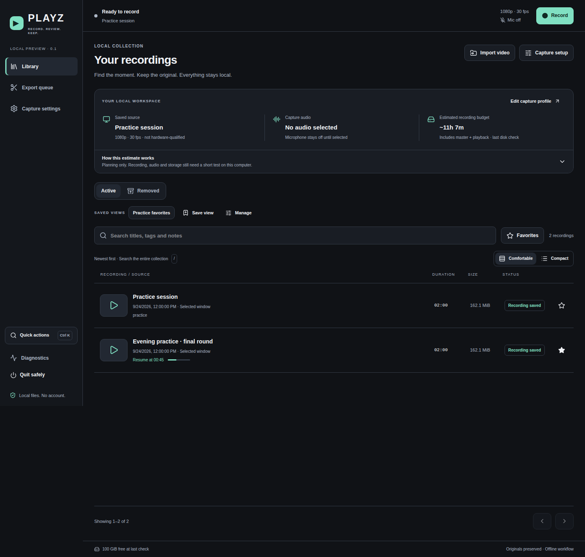
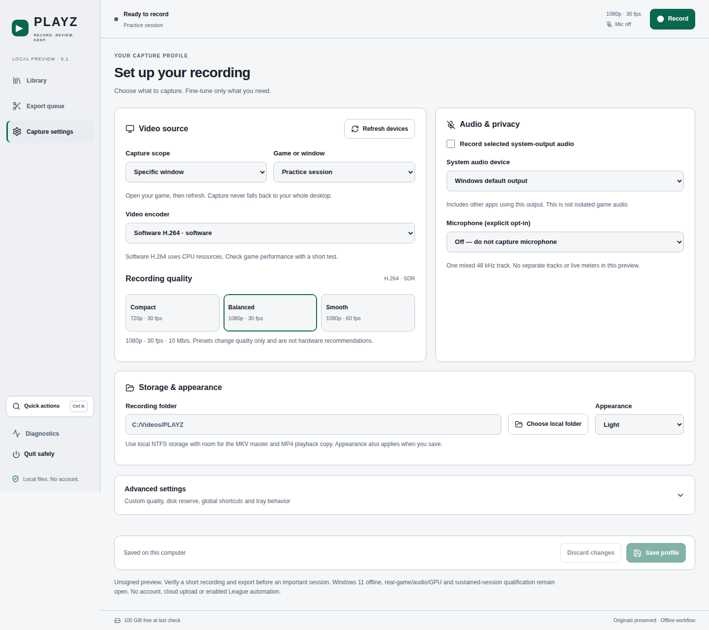
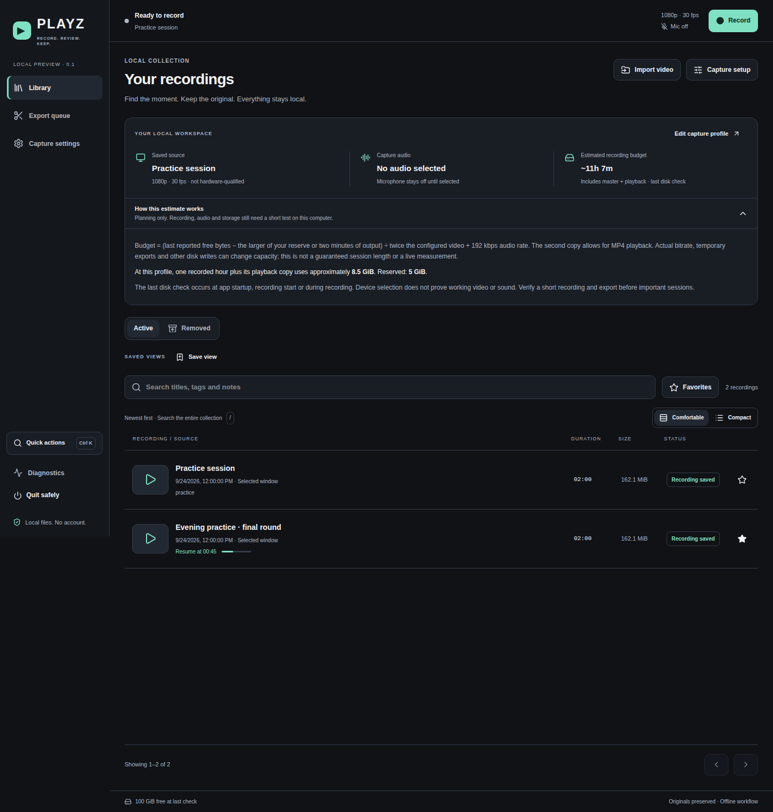
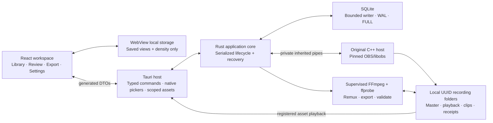
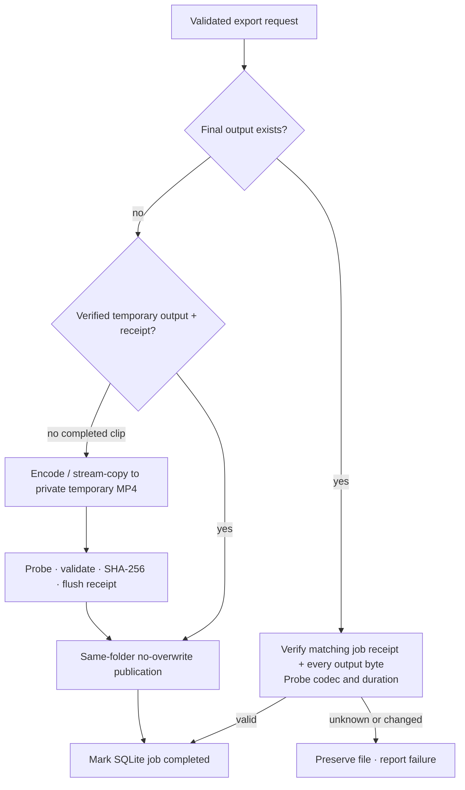

<div align="center">

# PLAYZ
### Record locally. Find the moment. Keep the original.

A Windows recording and review workspace built with **Tauri, Rust, React and OBS/libobs**.
No account. No application cloud service. No automatic publishing.

[Start here](#first-recording) · [Workspace guide](docs/WORKSPACE_GUIDE.md) · [Tech stack](#technology-stack) · [Build](docs/BUILD.md) · [Release gates](RELEASE_CHECKLIST.md)

</div>

> **0.1.0 · unsigned engineering preview.** There is a real native recording and installed review/export path, but this is not a production-qualified release. Clean offline Windows 11 installation, real-game/audio/GPU qualification, long-session testing, complete supply-chain review and signing remain open. **League automation is not enabled.** [Implementation status](IMPLEMENTATION_STATUS.md) distinguishes source features from acceptance evidence.



*Actual application renderer, deterministic test data. Screenshots illustrate UI behavior; they are not real-game, captured-audio or hardware evidence. Their source commit and image hashes are retained in [gallery provenance](docs/assets/gallery.json). The packaged Windows workflow is tested separately.*

## A small interface with deeper controls

| Workflow | Everyday controls | Advanced behavior |
|---|---|---|
| **Record** | Choose a source, select quality, save, record | Explicit encoder/audio devices, disk reserve, remappable hotkeys, safe stop/finalize, no desktop fallback |
| **Find** | Search, favorites, resume hints | Up to eight named saved views, Active/Removed collections, comfortable/compact density, database pagination + virtualized rows |
| **Review** | Local playback, bookmarks, 15/30-second clip selections | Numeric trim, playback speed, player-local keyboard controls, notes/tags, relink and recovery |
| **Export** | Accurate H.264/AAC MP4, visible queue | Explicit fast keyframe copy, cancellation/retry, capture-priority scheduling, SHA-256 receipt-backed interruption recovery |
| **Keep** | Originals remain intact | Reversible catalog removal, consistent SQLite backups, versioned manifests, validated relinking |

**New workspace tools:** save frequently used search/favorite/collection combinations; switch density without changing the catalog; press **/** to focus library search; see a resume hint derived from your saved playhead; inspect an explicitly approximate recording-storage budget. Preferences are local convenience data—not media copies, cloud sync or new recording settings.

<details>
<summary><strong>Screenshot gallery: saved views, light theme and storage planning</strong></summary>

### Saved views and resume hints


### Simplified capture settings in light mode


### Transparent storage estimate


All images use renderer fixtures. No benchmark values, hardware qualification or real-session results are implied.

</details>

## First recording

Use a **complete Windows x64 NSIS package**, not `PLAYZ.exe` copied out of its resource directory. For a development package, open a successful [Desktop verification and unsigned package run](https://github.com/Alex-Unnippillil/PLAYZ.obs/actions/workflows/desktop.yml), check its commit and installed-test result, and obtain its `windows-test-build-<commit>` artifact. Actions artifacts expire; the current build's artifact metadata is authoritative. This is not a signed public release channel.

1. Launch the game/window, open **Capture settings**, refresh devices, explicitly select the capture target and encoder, choose a local recording folder, and **Save profile**. The microphone stays off until selected. System-output audio can include other applications on the same output device.
2. Make a short recording and select **Stop recording**. Wait for finalization. In **Library**, verify the actual picture and sound, add a bookmark, select an interval, and queue an accurate export.
3. Restart PLAYZ and verify that the recording and exported clip remain accessible before trusting an important session. Device discovery alone does not prove working video, audio or a qualified encoder.

The recording pipeline is local. The build machine needs internet to acquire verified dependencies; clean, network-isolated installation is still a separate acceptance gate. Never disable security software or anti-cheat to work around capture problems.

### Quality without hidden scope changes

| Preset | Resolution | Frame rate | Video bitrate |
|---|---|---|---|
| Compact | 1280 × 720 | 30 fps | 6,000 kbps |
| Balanced | 1920 × 1080 | 30 fps | 10,000 kbps |
| Smooth | 1920 × 1080 | 60 fps | 16,000 kbps |

Presets fill only the quality fields; **Save profile** makes them effective. They never switch the microphone, source or encoder. Custom fields stay under **Advanced settings**. Leaving an unsaved profile through in-app navigation prompts to stay or discard. See the [controls guide](docs/UI_EXPERIENCE.md) and [workspace guide](docs/WORKSPACE_GUIDE.md).

### Keyboard workflow

| Context | Keys | Action |
|---|---|---|
| App, outside text fields/dialogs | **Ctrl+K** | Search workspace navigation |
| Library, outside text fields/dialogs | **/** | Focus recording search |
| Focused review player | **J / K / L** | Seek backward / play-pause / seek forward |
| Focused review player | **I / O / B** | Trim-in / trim-out / bookmark |
| Desktop global shortcuts | Configured in Advanced settings | Record/stop and live bookmark; native registration can fail on conflicts |

These are ordinary playback/time-selection controls, not frame-accurate stepping. Live bookmark time is based on encoded-frame elapsed time, not independently calibrated media PTS.

## Technology stack

Versions below are **repository pins**, not a claim that each is the newest upstream release. The documentation check verifies this table against manifests. Lockfiles and the [dependency register](third_party/DEPENDENCIES.md) retain the full dependency graph and licensing detail.

<!-- stack-pins:start -->
| Responsibility | Component / pin | Role and distribution |
|---|---|---|
| Desktop shell | Tauri **2.11.6**; JavaScript API **2.11.1** | Narrow native commands, tray, single instance and scoped media assets; shipped |
| UI | React **19.3.0**; TypeScript **7.0.2** | Typed, original interface; static UI ships, compiler does not |
| Build and styling | Vite **8.3.0**; Tailwind CSS **4.3.3** | Compiled assets; no Node server or remote CSS at runtime |
| Accessible primitives/icons | Radix Dialog **1.1.23**; Lucide React **1.47.0** | Dialog focus semantics and consistent icons; shipped UI dependencies |
| Local async data | TanStack Query **5.103.2**; Virtual **3.14.13** | Local-command caching and bounded visible rows; shipped |
| Forms | React Hook Form **7.88.0**; Zod **4.6.5** | Renderer validation; Rust remains authoritative |
| Native async core | Rust **1.98.1**; Tokio **1.53.1** | Supervision, media jobs and cancellation; compiled native code |
| Serialization/contracts | serde **1.0.229**; ts-rs **12.0.1** | Versioned JSON and generated Rust/TypeScript DTOs |
| Database | rusqlite **0.40.2**; rusqlite_migration **2.6.0** | Bundled SQLite, one bounded writer, migrations and consistent backup |
| Capture | OBS/libobs **32.2.2**; original C++ host | Reuses upstream capture/encoding technology, not an invented recorder |
| Media | FFmpeg/ffprobe **9.0.2** | Bundled probing, compatible remux and validated clip encoding |
| Native JSON / hashing | nlohmann/json **3.12.0**; sha2 **0.11.0** | IPC parsing and export-receipt integrity |
| Frontend tests | Vitest **5.0.1**; Testing Library React **16.3.3** | Development-only component/logic regression suite |
| Browser/accessibility tests | Playwright **1.63.0**; axe-core Playwright **4.13.0** | Development-only renderer checks and reproducible screenshots |
| Build tooling | Node **22.23.2**; pnpm **12.6.0** | Build machine only; frozen dependency installation |
<!-- stack-pins:end -->

Source of truth: [frontend manifest](apps/desktop/package.json), [Rust workspace](Cargo.toml), [core manifest](crates/playz-core/Cargo.toml), [Tauri manifest](apps/desktop/src-tauri/Cargo.toml), [native checksum lock](third_party/native-lock.json), [Rust toolchain](rust-toolchain.toml) and [Node pin](.node-version).

**Platform dependencies:** Windows, Microsoft WebView2 and GPU drivers are proprietary. The project does not claim an entirely open-source runtime. The installer uses Tauri's full `offlineInstaller` WebView2 mode, not a first-launch bootstrap download. The actual SQLite runtime is queried in diagnostics/tests rather than inferred from the wrapper version; historical native evidence reports 3.53.2, and startup enforces the minimum patched version in the core.

## Architecture

The renderer sends intentions; the Rust core owns durable state and recording decisions. Media work and capture run outside the renderer. There is no local web server for normal product operation and no application backend service.



[TanStack's `networkMode: 'always'`](https://tanstack.com/query/latest/docs/framework/react/guides/network-mode) keeps local queries/mutations operational when the computer loses internet. Recording starts are explicit, correlated requests, not automatically retried mutations. A renderer reload does not intentionally stop recording; a controller crash can interrupt an MKV and must be recovered. Those are different failure cases.

### Non-destructive clip pipeline



Malformed or mismatched receipts fail closed; no file is adopted merely because its duration looks plausible. A receipt is a local crash-consistency record, **not a signature against a malicious same-user process**. Accurate export re-encodes H.264/AAC; fast mode stream-copies and may include footage before trim-in. Recording takes priority over exports: a paused encode restarts at trim-in, not an arbitrary byte offset. See [export recovery](docs/EXPORT_RECOVERY.md).

### Where data lives

```text
Per-user application-data folder (resolved by Tauri)
  library.sqlite3              catalog, settings, bookmarks and jobs
  library.sqlite3-wal / -shm   SQLite-managed runtime files
  backups/                     consistent catalog snapshots

User-selected local recording folder
  <recording-uuid>/
    master.mkv                 preserved capture master (imports may be MP4)
    manifest.json              versioned reconstruction/relink metadata
    playback.mp4               compatible, losslessly remuxed playback asset
    exports/
      <name>-<id-prefix>.mp4    final exported clip
      .<job-uuid>.tmp.mp4       private in-progress output
      .<job-uuid>.tmp.receipt.json

WebView local storage
  playz.library.preferences.v1  saved view names/search filters + density
```

Back up the catalog through **Diagnostics → Consistent library backup**, then back up recording folders separately. The database backup does not contain video or WebView preferences. **Remove entry** hides a catalog item; **Library → Removed → Restore** restores visibility and metadata, not externally deleted media. Relink requires the original UUID folder and matching manifest. See [removed recordings](docs/REMOVED_RECORDINGS.md) and [recovery/privacy](docs/RECOVERY_PRIVACY.md).

## Advanced implementation details

| Boundary | Current implementation |
|---|---|
| Native command security | Individually declared Tauri permissions, restrictive CSP, native file pickers and ID-based registered asset lookup; no unrestricted renderer shell |
| Recorder supervision | Serialized operations, request UUIDs, bounded versioned JSON over inherited handles, deadlines and owned child processes |
| SQLite durability | 64-item writer channel, dedicated thread, parameterized SQL, foreign keys, WAL/FULL, five-second busy timeout; refuse unsafe schema downgrade |
| Media input | Bundled executables, argument arrays rather than shell strings, local file/pipe protocol allowlist, bounded probe/progress streams |
| Library scale | Database queries cover the collection; 50-entry pages with virtualized visible rows; density changes presentation, not media or ordering |
| View persistence | Versioned and size-bounded convenience state; unique names, eight-view cap, explicit reset; invalid/future state preserved until reset |
| Storage planning | BigInt byte counters; reserve floor matches the Rust formula; two-copy allowance for master + playback; last reading, not a live capacity guarantee |

The storage formula is `seconds ≈ max(0, free − reserve) / (2 × output_bytes_per_second)`, where `output_bytes_per_second = (video_kbps + 192) × 125`, and `reserve = max(configured_GiB × 2^30, output_bytes_per_second × 120)`. Audio is budgeted conservatively even when disabled. A zero/unavailable disk reading shows **unavailable**, not zero capacity. Other writes, variable bitrate and exports can invalidate the estimate. There are **no claimed FPS-impact, GPU, RAM, endurance or A/V-drift benchmarks** in these charts.

## Build and verify

Build on Windows with PowerShell 7, Visual Studio 2022 C++ tools/Windows SDK, CMake, Python and the pinned Node/pnpm/Rust toolchains. Exact prerequisites and packaging behavior are in [BUILD.md](docs/BUILD.md).

```powershell
./scripts/bootstrap.ps1
./scripts/bootstrap.ps1 -Native
./scripts/test.ps1 -Native -Media
./scripts/package.ps1 -SkipNative
# Disposable Windows test account: installs and drives the actual package
./scripts/test-installed.ps1
```

The native bootstrap verifies upstream checksums and compiles **our thin C++ adapter against matching OBS headers/runtime**; it does not rebuild the entire upstream OBS tree. Packaging writes the installer to `target/release/bundle/nsis/` and its commit, SHA-256, size and signing status to `artifacts/package-evidence.json`. Product source, reviewed head, CI merge checkout and final main SHA can differ; compare full Git trees and retain the actual artifact build identity.

### Test layers, not interchangeable claims

| Layer | Entry point | What it establishes |
|---|---|---|
| Logic/components | `pnpm typecheck`; `pnpm test`; `pnpm build` | Typed UI, state/validation behavior and compiled frontend |
| Rust domain/persistence | `cargo test -p playz-core --locked --all-targets` | State, contracts, SQLite, paths, recovery and safety regressions; runtime-dependent suites are explicitly separate |
| Actual media | `./scripts/test-media.ps1` | Real bundled FFmpeg, decoded trim/audio fixtures, receipt recovery and unchanged original hashes |
| Selected-window capture | `./scripts/test-capture.ps1` | Rust-to-libobs fixture-window path, not real-game or GPU qualification |
| Renderer/browser | `pnpm --dir apps/desktop exec playwright test --config playwright.ui.config.ts` | Keyboard, view persistence, reflow, axe and screenshots with injected test data; requires built assets/media fixture |
| Installed desktop | `./scripts/test-installed.ps1` | Real NSIS/WebView2/native commands, playback/export and restart persistence on the tested Windows environment |
| Documentation | `python scripts/check-docs.py` | Local links, pinned stack values, gallery provenance/image integrity and required diagram blocks |

See [PR #4](https://github.com/Alex-Unnippillil/PLAYZ.obs/pull/4) for this increment's exact final check results and artifact handoff. No passing badge or test count here is inferred from the existence of test code. The [Actions workflows](.github/workflows) preserve build/test evidence; the [release checklist](RELEASE_CHECKLIST.md) remains the production gate.

## Scope and release readiness

**Implemented local scope:** explicit game/window selection; SDR H.264/AAC capture; one mixed audio track; preserved masters; playback/import/bookmarks; accurate/fast clip exports; recoverable jobs; searchable/restorable library; safe tray/quit/single-instance behavior; modern keyboard-accessible local UI.

**Not implemented or not qualified:** enabled League detection/event ingestion/automation; calibrated event-to-PTS synchronization; cloud/YouTube/Discord publishing; accounts; LLM coaching; per-game audio isolation; separate microphone tracks; live audio meters; HDR; automatic encoder fallback; autostart; comprehensive fault/restore matrix; clean offline Windows 11 consumer install; real-game/audio/GPU families; two-hour stability and performance; completed signing/SBOM/corresponding-source review. Preparatory `league.rs` rules and schema tables are not a working League integration.

Hosted Windows Server 2022 tests do not substitute for the [Windows 11/hardware acceptance procedure](docs/ACCEPTANCE.md). Responsive browser widths are not proof of physical multi-monitor/Windows display-scaling acceptance. Failed capture never silently expands to full-monitor recording.

## Documentation map

[Workspace and saved views](docs/WORKSPACE_GUIDE.md) · [Full UI controls](docs/UI_EXPERIENCE.md) · [Build](docs/BUILD.md) · [Architecture](docs/ARCHITECTURE.md) · [Export recovery](docs/EXPORT_RECOVERY.md) · [Removed recordings](docs/REMOVED_RECORDINGS.md) · [Recovery/privacy](docs/RECOVERY_PRIVACY.md) · [Acceptance](docs/ACCEPTANCE.md) · [Dependency register](third_party/DEPENDENCIES.md) · [Implementation status](IMPLEMENTATION_STATUS.md) · [Release checklist](RELEASE_CHECKLIST.md)

## Licensing and upstream technology

Original PLAYZ source is **GPL-2.0-or-later** where indicated by SPDX headers. Third-party components retain their licenses. OBS/libobs and FFmpeg obligations are not removed by process separation. Native provenance, notices, FFmpeg build flags and corresponding-source/SBOM review are part of release work; no blanket compliance claim is made.

No Ascent proprietary application code or branding is incorporated. The [recorder architecture decision](docs/adr/0001-recorder-backend.md) documents the original thin host around upstream OBS/libobs.

Primary references: [Tauri security](https://v2.tauri.app/security/capabilities/) · [Tauri Windows installer](https://v2.tauri.app/distribute/windows-installer/) · [OBS custom frontends](https://docs.obsproject.com/frontends) · [FFmpeg seeking and stream copy](https://ffmpeg.org/ffmpeg.html) · [SQLite WAL](https://www.sqlite.org/wal.html) · [SQLite backup](https://www.sqlite.org/backup.html) · [Accessible disclosure controls](https://www.w3.org/WAI/ARIA/apg/patterns/disclosure/) · [GitHub Mermaid diagrams](https://docs.github.com/en/get-started/writing-on-github/working-with-advanced-formatting/creating-diagrams).
